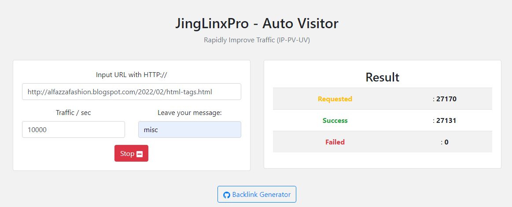
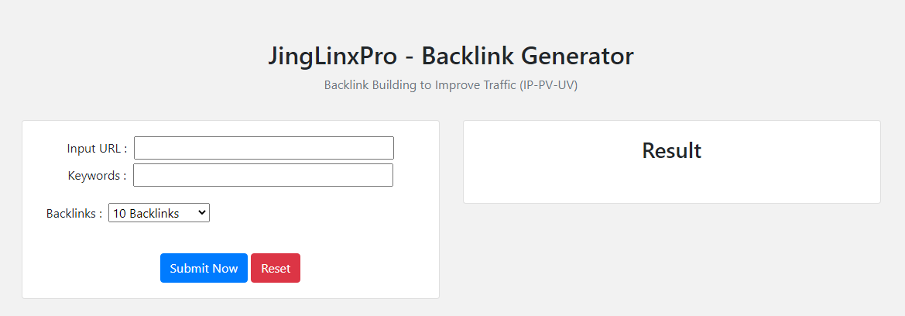
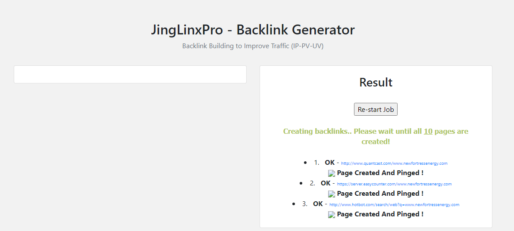
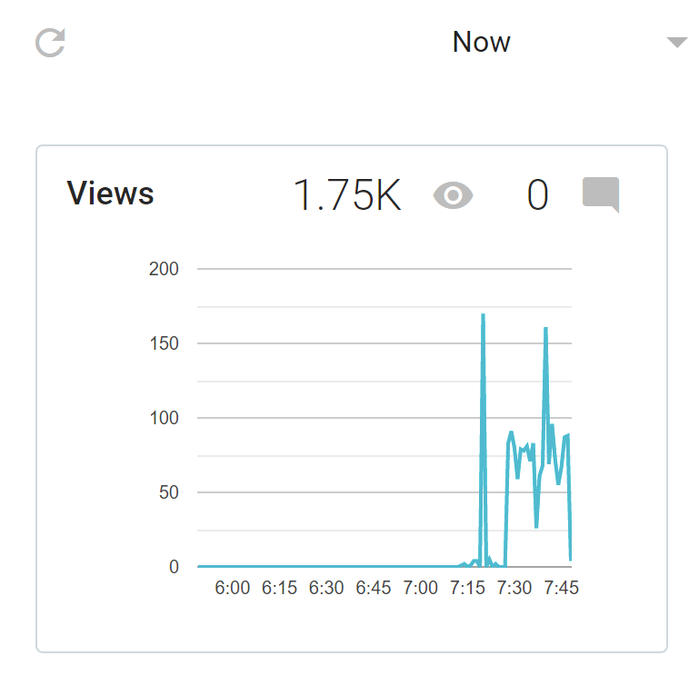
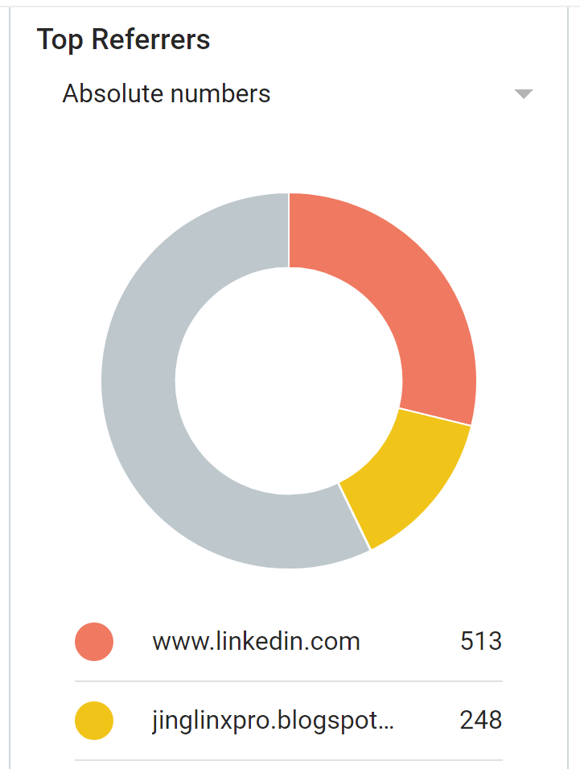
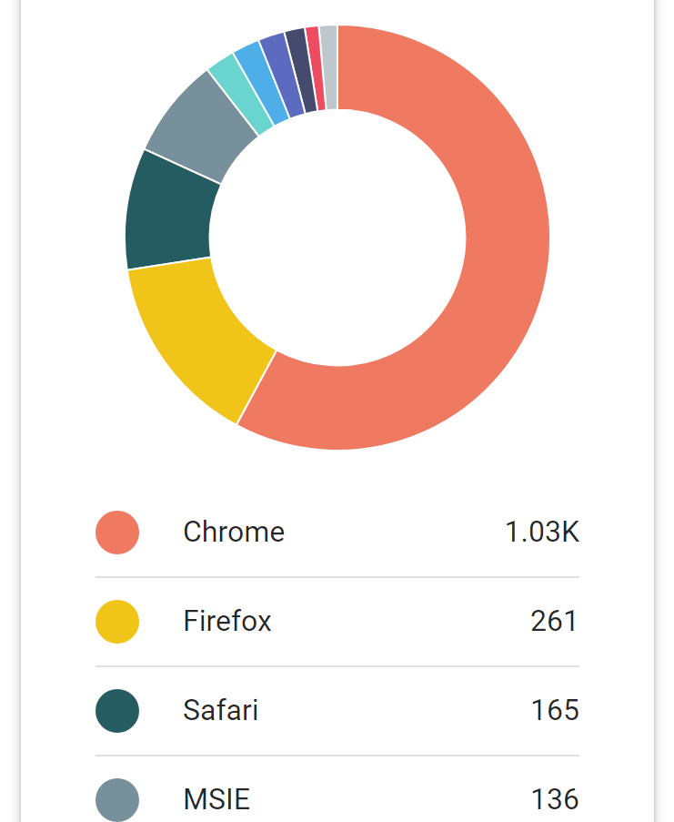
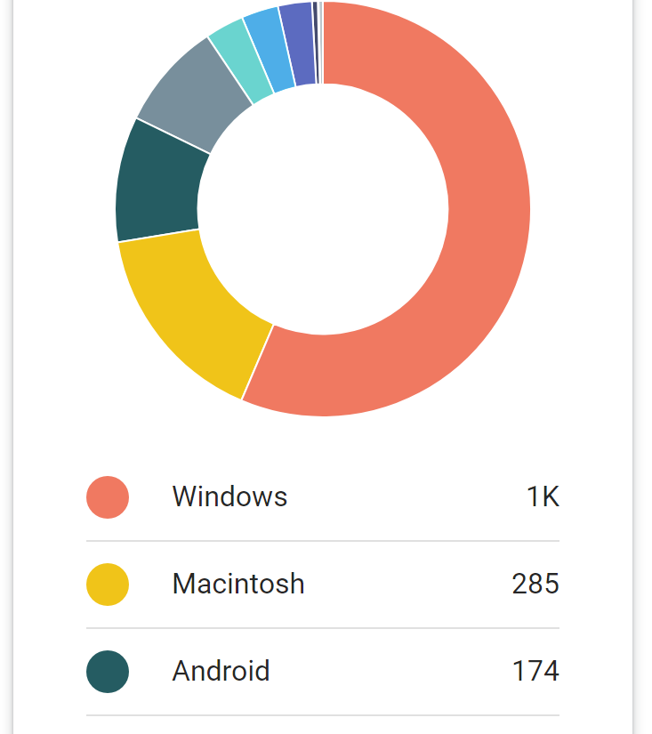
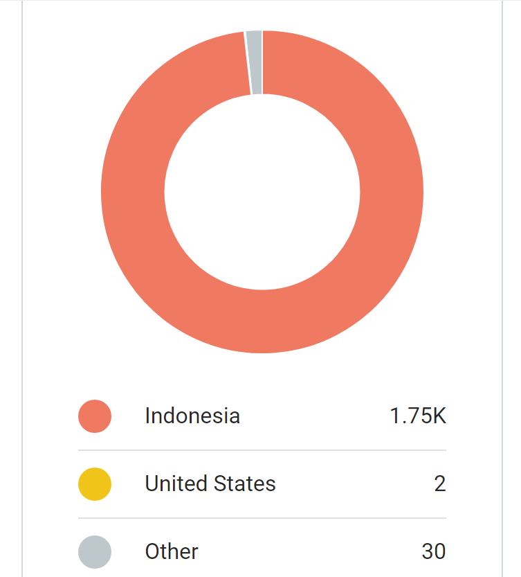

# smallseo

## 🔗 Traffic Generator (IP-PV-UV) [Demo](https://jinglinxpro.blogspot.com)

## 🔗 Backlink Generator [Demo](https://yt-backlink.blogspot.com)

## to do :
~~~
$ git clone https://github.com/alfazzafashion/smallseo.git
$ smallseo
$ http-server . 
~~~
Open your browser and GO...!!!

## Result

## Source Code:

* [DeVoresyah](https://github.com/DeVoresyah/jinxprooo/)

* [AhmadZxe](https://github.com/AhmadZxe/Blogger-AutoVisitor.git)

* [BarisCanigecgin](https://github.com/BarisCanigecgin/whois-backlink-otomasyonu.git)

* [Reborniot](https://github.com/reborniot/whois-backlink-generator.git)

* [Embedup](https://github.com/embedup/7540000-youtube-video-backlinks-generator.git)

* [Rvalitov](https://github.com/rvalitov/backlink-checker.git)

## Inspired Themes :

  * [ericmmartin](https://github.com/ericmmartin/simplemodal)
  
  * [prototype](http://www.prototypejs.org/)
